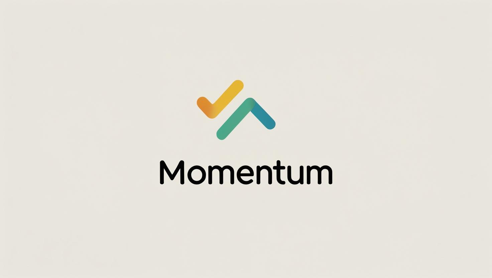

# HabitTracker - Application for forming habits



**HabitTracker** is an Android application for the systematic formation of useful habits with visualization of progress, using the principles of behavioral psychology and gamification.

## 🔍 About the project

The application helps to develop habits through a 60-day cycle with a visual visualization of progress. Key features:

- 🎯 Creating habits with personalized parameters

- 📊 Visualization of progress through colored pie charts

- 🔔 Notifications to maintain motivation

- 📱 Offline work with local storage

- 🏆 System of achievements and statistics

## 🛠 Technological stack

### Client part (Android)

- **Language**: Kotlin 1.9+

- **Architecture**: Single Activity + Clean Components

- **UI**: XML (ConstraintLayout, RecyclerView)

- **Asynchronous**: Kotlin Coroutines

- **Local storage**: SQLite with raw requests

- **Custom View**: Canvas-drawing progress circles

- **Animations**: Property Animation API

## 📱 Interface screenshots

<div style="display: flex; flex-wrap: wrap; gap: 16px; justify-content: center; margin: 20px 0;">
  
  
  
</div>

1. **Main screen**:

- Grid of habits (2 columns)

- Round progress indicators

- Habit name and day counter

- Add button in the lower right corner

2. **Adding a habit**:

- Name input field

- Emoji selection

- "Cancel" and "Add" buttons

3. **Habit progress**:

- Colored circular indicator (red/yellow/green)

- Current day counter (for example: "15/60 days")

- Habit icon in the center of the circle

4. **Context menu**:

- "Change" and "Delete" options

- Animation when appearing

- Confirmation of removal

## 🎨 Design and interface

The application uses Material Design 3 with custom elements:

- **Color scheme**:
  ```xml
  <color name="primary">#4CAF50</color>
  <color name="progress_start">#FF5252</color>
  <color name="progress_middle">#FFC107</color>
  <color name="progress_end">#4CAF50</color>
  
## 📄 License

The project is distributed under the MIT license. The full text is available in the LICENSE file.

## 📊 Application architecture

```mermaid
flowchart TD
    %% User Interface
    A[User] -->|Interacts with| B[UI Components]
    B --> C[MainActivity]
    
    %% UI Components
    C --> D[RecyclerView.Adapter]
    C --> E[CircleProgressView]
    C --> F[DialogManager]
    
    %% Business Logic
    C --> G[ViewModel]
    G --> H["Use Cases:
    - UpdateProgress
    - AddHabit
    - DeleteHabit"]
    
    %% Data Layer
    G --> I[Repository]
    I --> J[Local Database]
    J --> K[SQLite]
    I --> L[In-Memory Cache]
    
    %% Interactions
    D -->|Displays| M[Habits List]
    E -->|Shows| N[0-60 Day Progress]
    F -->|Manages| O[Dialog Flows]
    K -->|Stores| P["Habit(
      id: Long,
      name: String,
      emoji: String,
      streak: Int
    )"]
    
    %% Legend
    subgraph Legend["Architecture Layers"]
        direction TB
        leg1[View Layer]:::view --> leg2[Domain Layer]:::domain
        leg2 --> leg3[Data Layer]:::data
    end

